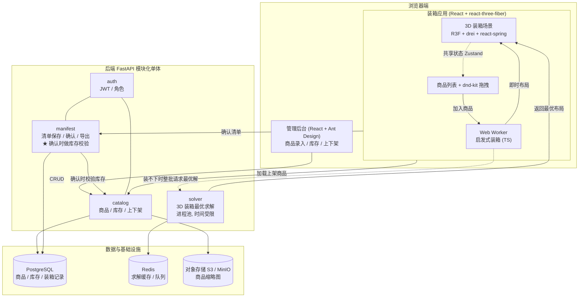
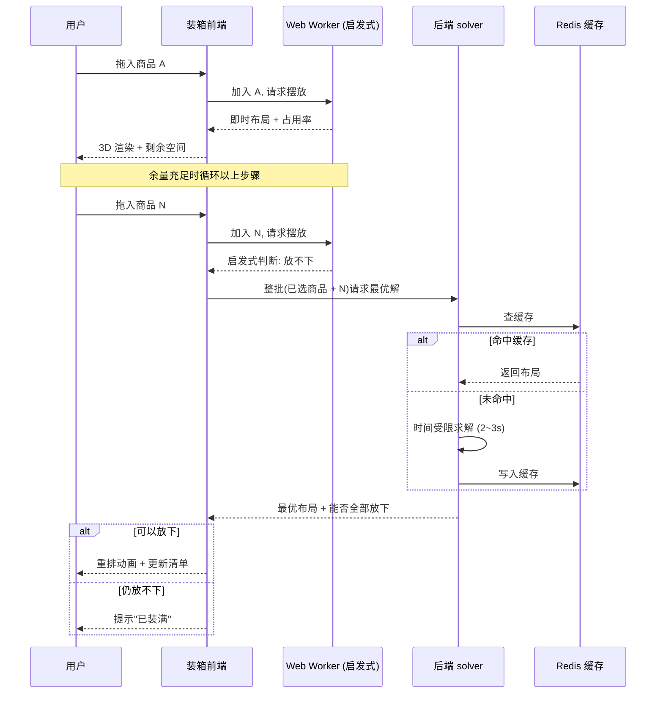
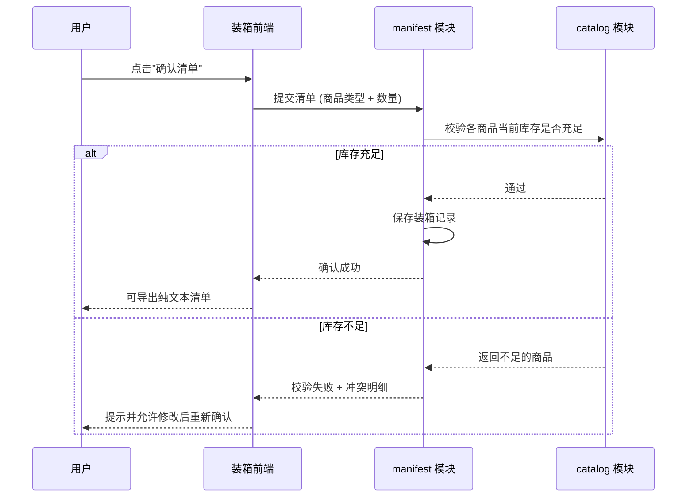

# 系统架构说明

## 1. 整体架构

## 2. 组件职责

| 组件 | 职责 |
| --- | --- |
| 装箱应用 (packing-web) | 3D 展示箱体与物品码放、商品列表拖拽、即时占用率/剩余空间、调用后端求最优解、生成并导出清单 |
| 管理后台 (admin-web) | 商品录入与编辑、缩略图上传、库存维护、上下架状态管理 |
| Web Worker | 在浏览器内运行启发式装箱，余量充足时即时给出摆放位置，不阻塞 UI 线程 |
| auth | 登录鉴权、JWT 签发、装箱端与管理端的角色区分 |
| catalog | 商品 CRUD、库存、上下架；对外提供"上架商品列表"与"库存校验" |
| solver | 时间受限的 3D 装箱最优（近优）求解，跑在进程池/Celery worker，结果写 Redis 缓存 |
| manifest | 保存装箱清单、确认时做库存校验、导出纯文本清单 |
| PostgreSQL | 商品、库存、保存的装箱记录 |
| Redis | 求解结果缓存（按"商品集合+箱体"为 key）、可选作为任务队列 broker |
| 对象存储 | 商品缩略图（不入库），配 CDN 加速 |

## 3. 混合装箱算法：handoff 时序

余量充足时由前端启发式即时摆放；当启发式判断"放不下"时，把**已选的全部商品 + 这件新商品整批**发给后端重新求最优布局——能全部放下就返回新布局并触发重排，连最优解都放不下才算真正"装满"。

**要点：**
- 后端求解是"重排整批"而非"只摆这一件"——启发式的"放不下"只是局部贪心结论，换排布可能就放下了。
- "最优解"实际是**时间受限内的近优解**（设 2~3s 上限）。装箱属 NP-hard，真正最优只在极小规模可解；触发点在"快满时"，规模被箱体容量天然限制，时间受限求解足够。
- 求解**不要跑在 API 请求线程里**，放进程池/Celery worker，避免堵塞接口。
- 后端返回的最优布局可能与前端启发式布局不同，物品会移动；前端用 react-spring 做位置过渡动画，平滑展示"重新码放"。

## 4. 确认装箱清单流程（库存只在此校验）

装箱过程中**不做实时库存判断**，纯几何计算；只有在最终确认时由 manifest 向 catalog 做一次性校验。是否在确认成功后扣减/预占库存，是一个待定的业务开关（默认仅记录、不扣减）。

## 5. 贯穿前后端的共享契约

整个混合算法能不出错的地基，是一份前后端共用的"摆放契约"：统一坐标系、单位、placement 数据结构和箱体尺寸定义。前端 TS 启发式与后端 Python 求解器实现同一份 schema，使两端布局可互换。

- 单位：毫米 (mm)，体积单位 mm³
- 坐标原点：箱体某一底角；x 沿长、y 沿宽、z 沿高(向上)
- `position` 表示物品轴对齐包围盒的最小角坐标
- 旋转：最多 6 种轴对齐朝向，用 `rotationType: 0..5` 表示

具体定义见 `packing-contract.ts`（前端）与 `packing_contract.py`（后端），两份必须保持同步。
